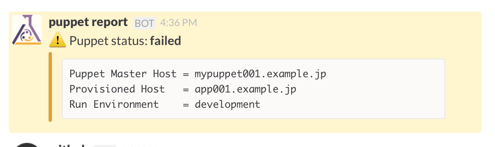

puppet-report_slack2
--------------------

Yet another slack report processor.

* https://github.com/udzura/puppet-report_slack2
* https://forge.puppetlabs.com/udzura/report_slack2



## Install && setup

Run:

```bash
puppet module install udzura-report_slack2
# or use librarian-puppet
```

Create config file `/etc/puppet/slack.yaml` as:

```yaml
---
username: "puppet reporter"
webhook: "https://hooks.slack.com/services/YOUR/incoming-web-hook/AddRess!!!"
channels:
  - "#udzura_dev"
report_url: 'https://puppetdashboard.example.jp/reports'

```

Puppet way, like this:

```puppet

class { 'report_slack2' :
  username   => 'puppet reporter',
  webhook    => 'https://hooks.slack.com/services/YOUR/incoming-web-hook/AddRess!!!',
  channels   => [ "#udzura_dev" ],
  report_url => 'https://puppetdashboard.example.jp/reports',
}
```

Then set reporter:

```toml
[master]
...

report  = true
reports = store,slack
```

## Reports URL

The reports URL can be left empty in the slack.yaml file for standalone setups and will appear in the Slack status message.

```yaml
reports_url: ''
```

If a report URL is set to a non empty value it will be included in the Slac status message.

```yaml
report_url: 'https://puppetdashboard.example.jp/reports'
```

The reports_url property also provides the ability to set interpolation of a hostname with self.host by using the ```%h``` sting within the reports_url value.  In the example below %h will be replaced with ths hostname of provisioned host. To create a link directly to a focused reports section

```yaml
reports_url: 'https://puppetdashboard.example.jp/%h/reports'
```

The above translates to something like https://puppetdashboard.example.jp/app001.example.jp/reports
## See also

* https://github.com/lamanotrama/puppet-report-ikachan
* https://github.com/fsalum/puppet-slack

## License

[MIT](./LICENSE).
